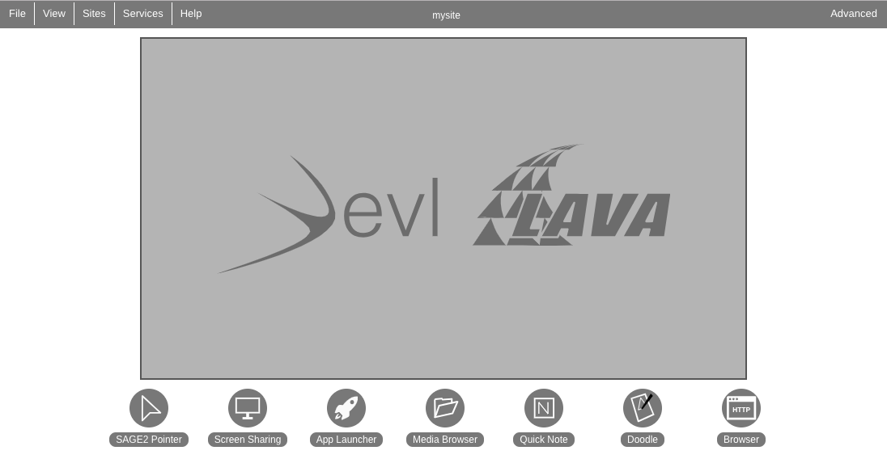

Sage2 Roll
======================

.. contents::  

Introduction
----------------

The `SAGE2 (Scalable Amplified Group Environment) software <http://sage2.sagecommons.org>`_  enables groups to work in front of large shared tile wall displays in order to solve problems that required juxtaposing large volumes of information in ultra high-resolution.  This Rocks roll facilitates the installation of SAGE2 on a Rocks cluster.  A SAGE2 server will be installed on the Rocks cluster frontend and SAGE2 Display Clients will be installed on the compute nodes to drive the tile wall displays.

Prerequisites
----------------
If your compute nodes have NVIDIA cards on them where the SAGE2 Display Clients will be installed, we recommend you install the `Rocks CUDA roll from the NBCR project <https://github.com/nbcrrolls/cuda>`_ to install the NVIDIA drivers for your displays.

Building and Installing
----------------
	
Checkout roll distribution from git repo :: 

   # git clone https://github.com/pragmagrid/Sage2-Roll
   # cd Sage2-Roll/

To build the roll, first execute a script that gets the 
needed dependencies to build the SAGE2 software :: 

   # ./bootstrap.sh    

Note, to build the main SAGE2 roll and some if its dependencies, it is necessary for some packages to be installed on your build host during the process.  Then to build the roll, please run :: 
		
   # make quickroll 2>&1 | tee make.log 
  	
If successful, this will build a .iso file called ''Sage2-*.disk1.iso''. Note that the traditional 'make roll' command will also work but will rebuild packages built during the bootstrap.sh execution ::
	
To install on a node, execute ::
	
   # rocks add roll *.iso
   # rocks enable roll Sage2
   # (cd /export/rocks/install; rocks create distro)
   # rocks run roll Sage2 | bash
	
When the roll is finished running, the SAGE2 server will be running on port 9090.  To connect, go to https://<your hostname>:9090.  Note that by default self-signed certificates are generated for the server so you will likely need to add an exception to your browser to view the page.  Once you do, you should see a screen like below:

To setup the tile wall displays, you will need to reinstall your compute nodes so they will have the x11 environment ::

   # rocks set host boot compute-X-Y action=install
   # rocks run host compute-X-Y reboot

##Basic User's Guide
	
More in depth instructions (not specific to Rocks) can be found at the [Sage2 website](http://sage2.sagecommons.org/instructions/).

**Post Installation**
	
* Inside the main /opt/Sage2 folder, go to the keys directory and edit the servers variable of the GO-linux script with the ip address of the node that will be running the Sage2 server. 
* Then run the GO-linux script with:
		
*		# ./GO-linux  

* This will generate the self signed certificates needed for https connections (note, it is always better to use properly signed certificates but this will funciton if you are just trying to get Sage2 to work).
* Now go back to the main Sage2 directory and run the command:
* 		# npm run in

* This will install all the needed NodeJS dependencies for Sage2

**Making a Sage2 Config File**

From the [Sage2 bitbucket Wiki](https://bitbucket.org/sage2/sage2/wiki/Configuration):

	{
    host:                            // hostname or ip address of the web server
    name:                            // OPTIONAL: name used in some UI (free string, defaults to hostname above)
    port:                            // HTTP port that all clients, except web ui, are served on (default: 80)
    secure_port:                     // HTTPS port that all clients are served on (default: 443)
    rproxy_port:                     // OPTIONAL: port of the HTTP reverse proxy (only required for reverse proxy setups)
    rproxy_secure_port:              // OPTIONAL: port of the HTTPS reverse proxy (only required for reverse proxy setups)
    url:                             // OPTIONAL: URL shown on display, instead of using hostname (allows for short URL)
    background: {
        color:                       // CSS color for the background (hex, rgba(), etc.)
        image: {                     // OPTIONAL: 
            url:                     // relative path from the 'public' directory to an image used for the background
            style:                   // either "fit", "stretch", or "tile"
        }
        watermark: {                 // OPTIONAL: 
            svg:                     // relative path from the 'public' directory to a monochrome SVG image used for the watermark
            color:                   // CSS color for the watermark (rgba() recommended)
        }
        clip:                        // OPTIONAL: boolean, whether or not to clip the display at the exact resolution (default: true)
    }
    register_site:                   // OPTIONAL: boolean, whether or to register to EVL site (for stats). (default: true)
    ui: {
        clock:                       // 12 or 24 (specifies whether to use a 12 or 24 hour clock)
        show_url:                    // boolean, whether or not to show the host url on the display clients
        show_version:                // boolean, whether or not to show the SAGE2 version number on the display clients
        menubar: {                   // OPTIONAL: 
            backgroundColor:         // OPTIONAL: CSS color for the background of the menubar (default: "rgba(0, 0, 0, 0.5)")
            textColor:               // OPTIONAL: CSS color for the text of the menubar (default: "rgba(255, 255, 255, 1.0)")
            remoteConnectedColor:    // OPTIONAL: CSS color for remote sites that are connected (default: "rgba(55, 153, 130, 1.0)")
            remoteDisconnectedColor: // OPTIONAL: CSS color for remote sites that are not connected (default: "rgba(173, 42, 42, 1.0)")
        }
        auto_hide_ui:                // OPTIONAL: boolean, whether or not to autohide wall UI decoration (default: false)
        auto_hide_delay:             // OPTIONAL: integer, number of seconds after which to hide the wall UI (default: 30)
        auto_scale_ui:               // OPTIONAL: boolean, whether or not to automatically scale the wall UI based on resolution and screen dimensions (default: false)
        calculate_viewing_distance:  // OPTIONAL: boolean, calculates the optimal viewing_distance for auto_scale_ui (default: false)
        titleBarHeight:              // OPTIONAL: integer, specify window titlebar height in pixels (default: 2.5% of minimum dimension of total wall)
        titleTextSize:               // OPTIONAL: integer, specify text size of ui titles in pixels (default: 1.5% of minimum dimension of total wall)
        pointerSize:                 // OPTIONAL: integer, specify pointer size in pixels (default: 8% of minimum dimension of total wall)
        noDropShadow:                // OPTIONAL: boolean, whether or not to disable drop shadows on wall UI decoration (default: false)
        minWindowWidth:              // OPTIONAL: integer, minimum width for application windows in pixels (default: 8% of minimum dimension of total wall)
        minWindowHeight:             // OPTIONAL: integer, maximum width for application windows in pixels (default: 120% of maximum dimension of total wall)
        maxWindowWidth:              // OPTIONAL: integer, minimum height for application windows in pixels (default: 8% of minimum dimension of total wall)
        maxWindowHeight:             // OPTIONAL: integer, maximum height for application windows in pixels (default: 120% of maximum dimension of total wall)
        startup_sound:               // OPTIONAL: string, filename to a valid sound file played at startup (wav, mp3, ogg, ... depending on your browser).
    }
    resolution: {
        width:                       // width in pixels of a display client (browser window width)
        height:                      // height in pixels of a display client (browser window height)
    },
    dimensions: {
        tile_width:                  // OPTIONAL: width of a single display tile in meters, pixel area
        tile_height:                 // OPTIONAL: height of a single display tile in meters, pixel area
        tile_borders:                // OPTIONAL: mullions in meters, object {left: xxx, right: , top: , bottom: }
        tile_overlap:                // OPTIONAL: overlapping area for edge blending, integer in pixels {horizontal: xxx, vertical: xxx}
        viewing_distance:            // OPTIONAL: preferred or common viewing distance in meters to calculate UI sizes
    },
    layout: {
        rows:                        // number of rows of display clients (browser windows) that make up the display wall
        columns:                     // number of columns of display clients (browser windows) that make up the display wall
    },
    displays: [                      // array of displays
        {
            row:                     // the row where this display tiles in the display wall (row origin starts with zero at left)
            column:                  // the column where this display tiles in the display wall (column origin starts with zero at the top)
        },
        ...                          // list length should equal rows*columns
    ],
    alternate_hosts: [               // array of alternate hostnames for machine (i.e. private network IP, localhost, etc.)
        ...
    ],
    remote_sites: [                  // array of remote SAGE2 sites to be able to share content with
        {
            name:                    // (string) name to be displayed on display wall
            host:                    // (string) specify the remote machine to connect with (in conjunction with port)
            port:                    // (number) specify the remote machine to connect with (in conjunction with host)
            secure:                  // (bool)   specify if the URL is a secure connection or not (https vs http)
            password:                // (string) clear text password to connect to the remote site
            session:                 // (string) MD5 hash of the password for the remote site (alternative to password)
        },
        ...                          // list as many remote sites as desired
    ],
    dependencies: {
        ImageMagick:                 // full path to ImageMagick (use "/" as path delimiter, required for Windows only)
        FFMpeg:                      // full path to FFMpeg (use "/" as path delimiter, required for Windows only)
    }
	}
	
* In addition you can use the included default-cfg.json and just change the name, layout, resolution, and displays to fit your actual display wall config to get setup quickly. 
* For instance if you had a setup of 4 1080p displays arranged in a 2x2 matrix: 
	* The resolution section would have a height of 1080 and a width of 1920.
	* The layout would have 2 rows and 2 columns. 
	* Lastly you would have four entries in the displays section each with a different row and/or column. For our example you have display row 0 and column 0, row 0 and column 1, row 1 and column 0, and row 1 column 1.

**Starting the Sage2 Server**

* In the main Sage2 folder, run:
*       # node server.js
   
	 This will run the sage2 server process, however it will use the default config file that assumes your display wall contains only a single 1080p monitor, which must be changed if your display wall's configuration differs from this. To change this add the -f flag followed by the path of your custom config file.
* From your front end launch google chrome on each display node  by launching a google chrome window (the preferred browser by Sage2's developers) for each monitor in your Sage2 wall: 
* 			# runuser -l WALL_USERNAME -c 'ssh -t NODE_HOST_NAME "export DISPLAY=CURRENT_DISPLAY && google-chrome --user-data-dir=~/.config/google-chrome/TILE_CONFIG_PROFILE --kiosk --app=https://SAGE2_SERVER_IP:SAGE2_PORT/display.html?clientID=TILE_ID "'&

* You may see a warning about in chrome that the following website is unsecure due to a self-signed https certificate, just click advance and procced to the ip of your sage2 server. You might also want to consider using a properly signed certificate later as well so new users don't have to do this.
* WALL_USERNAME is the username you use to login to each compute node (in mine for instance its sageuser) while NODE_HOST_NAME is the hostname of the compute node (such as compute-0-0) you are logging into. 
* CURRENT_DISPLAY is the output of $DISPLAY (assuming each display is it's own x window, which in my experience had alot less issues than with xinerama enabled) which is the monitor that you want to launch one part of your sage2 server on. This also ties in with the TILE_ID as that represents which part of the wall is displayed. For instance if you had a 4 monitor display wall client id 0 might be the top right part of the wall while id 3 is the lower right portion, it depends on your Sage2 config file.
* TILE_CONFIG_PROFILE should be different for each monitor you are launching the sage2 server on as otherwise chrome will complain about having to share the same profile for multiple instances of chrome of the same username. 

* The server can be exited by typing exit on the Sage2 sever console.

**Interacting with the Sage2 Wall**

* In the web browser of your choice (again google-chrome is recommended) go to:

* 		# https://SAGE2_SERVER_IP:SAGE2_PORT
* If you get the same security warning in your browser as described above, follow the same instructions and proceed to the ip address of your sage2 server. 
* Once you are at the main page of the sage2 server, it presents you with a simplified version of what is currently being displayed on the actual display wall with buttons going from left to right on the bottom of the browser window:
	* SAGE2 Pointer takes control of your keyboard and mouse (has to be allowed in your browser settings) so your cursor movments are on the wall itself, this can be exited by hitting the escape key.
	* Screen Sharing (currently for google chrome only with an extension) allows you to broadcast the contents of a window or the whole screen to the display wall from your own computer.
	* App launcher will open a window that shows all the possible apps that come with Sage2 (there is an api that allows you to develop your own as well) and allows limited interaction on this page while the full interaction is on the wall itself while in sage2 pointer mode.
	* Media browser shows a file explorer like window that allows you to launch pdfs, images, video files and more to be displayed on your display wall. In addition, it allows you to drag and drop new files from your desktop to be uploaded to the wall. 
	* Arrangment allows you to take whatever is on the display wall currently and either clear it, make it tiled, or save the arrangement for later if it gets changed.
	* The settings button allows you to customize the name that shows up when your cursor goes onto the display wall as well as the color. It also lets you choose the streaming quality if you want to share your screen.
	* Information gives some details on the wall's configuration, the version of sage2, a link to the documentation, and some admin controls.
	* Quick Note and Doodle allows you to place sticky notes on the wall and draw items respectively.
* After activating the SAGE2 Pointer, you can right click to show the radial menu which allows you to do many of the same tasks as the main server webpage but in a format that is better suited to display wall interaction. 
* Once you launch an app on the sage wall, right clicking it while using the sage2 pointer will bring up any additional functionality that is available for that app. For instance if a video is playing in the player app, right clicking it will let you pause/play, scrub through, and stop the video currently playing.

##Acknowledgements

* Sage2: This software includes SAGE2(tm) middleware developed by the Electronic Visualization
Laboratory at the University of Illinois at Chicago, and the Laboratory for
Advanced Visualization and Applications at the University of Hawai'i at Manoa.

